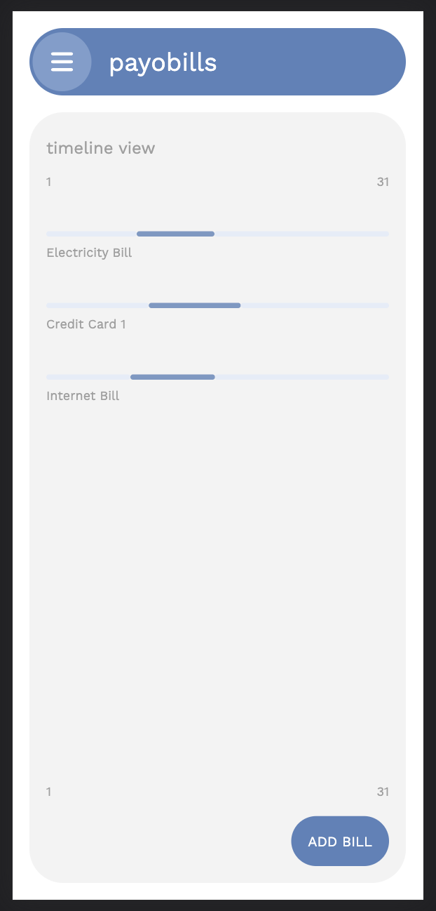
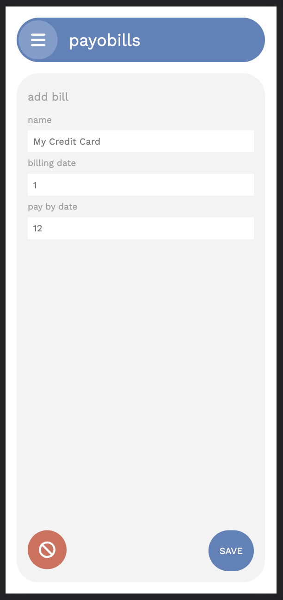

# payobills
A self-hosted (Bring and Keep your own Data) bill management app - very much WIP

## why create such an app?
- Help me with all my bill related needs.
- Learning Kubernetes
- Contributing to the Self-Hosted open source community

## project setup (headed towards this setup)
- Each microservice in a folder in `apps` directory
- A build system to help managing deployment and running the services
- Code reuse with packages 
