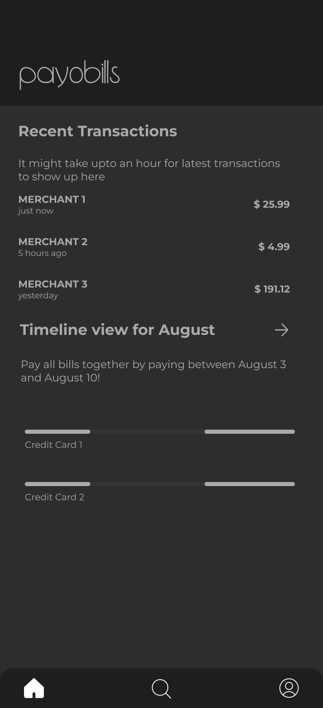
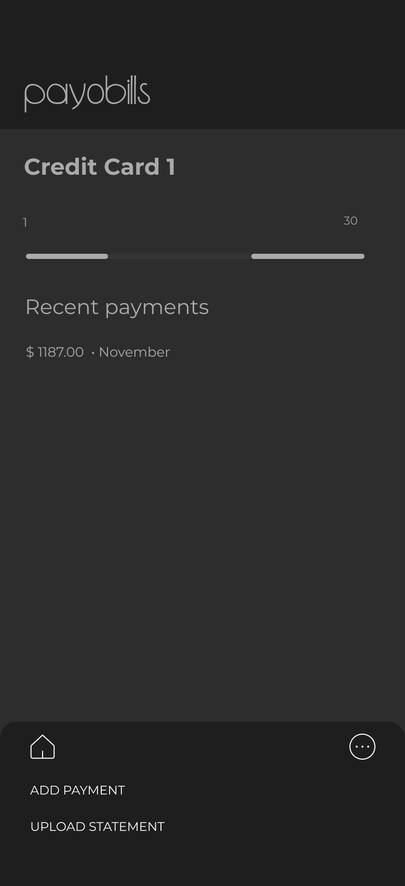
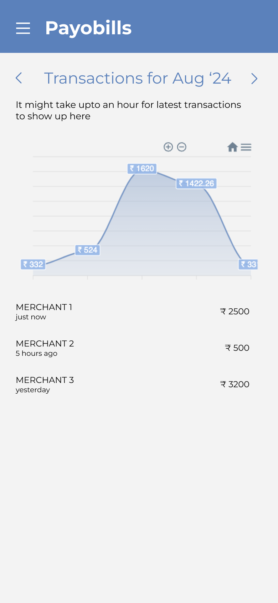

# payobills

A self-hosted (Bring and Keep your own Data) bill management app. 

## Screenshots
Here's the [Figma Link](https://www.figma.com/design/RuZ5khlNpA4IgKPb1iebzc/payobills-main) 😊 - feel free to connect with me if you're a designer and want to contribute!

| Timeline view of bills | Details for a bill | Monthly transactions page |
| --- | --- | --- |
|  |  |  | 

## Why create such an app?
- Help me with all my bill related needs; save time and pay bills together.
- Analytics from all my financial data, without exposing my data.
- Learning Kubernetes and tooling across the stack
- Contributing to the Self-Hosted open source community

## Project structure
- Each microservice in a folder in `apps` directory
- A build system to help managing deployment and running the services - uses [Please.Build](https://please.build) by [@thought-machine](https://github.com/thought-machine)
- Code reuse with packages

## Deployment
This project uses a sibling project I created [@mrsauravsahu/kube-homelab](https://github.com/mrsauravsahu/kube-homelab) to create a Kubernetes Cluster using Raspberry Pi nodes - more details on my [YouTube channel @mrsauravsahuin](https://www.youtube.com/watch?v=LfBcERF6qw4)

